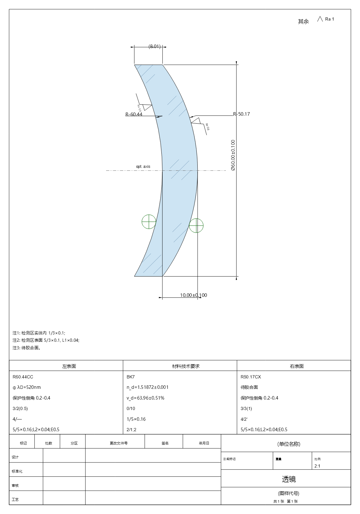
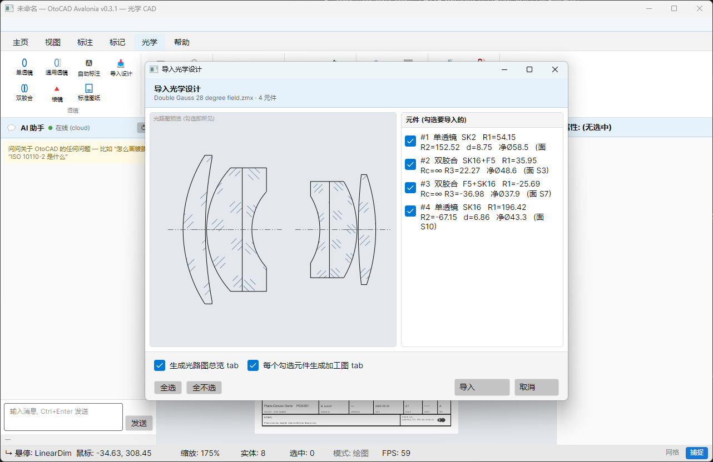

# OtoCAD — Import a Zemax lens file, get a complete set of manufacturing drawings

[简体中文](README.md) | **English**

[](https://github.com/otocad/Otocad-Community/actions/workflows/ci.yml)
[](https://github.com/otocad/Otocad-Community/releases)
[](LICENSE)


> **🌐 Website & downloads: [cad.optic.chat](https://cad.optic.chat)** — portable, unzip-and-run (Windows / Linux / macOS)

OtoCAD is an open-source 2D optical CAD. **One Zemax lens file goes in; a system layout drawing plus one standard
manufacturing drawing per element come out** — GB / ISO drawing frames, property zones, dimensions, optical codes and
technical requirements in one pass, a pre-delivery checklist to verify every sheet, then DXF / PDF straight to the shop.
Underneath is a complete 2D CAD, so whatever the wizards do not cover you finish by hand.



---

## Four steps to a full drawing set

Not one sheet at a time: one lens file in, one deliverable set of drawings out.

| Step | What happens |
|---|---|
| **1. Import the design** | Import a whole Zemax `.zmx` or Optic JSON (Optiland) file at once. Surface types, radii, thicknesses, glasses and clear apertures are read automatically; singlets and cemented groups are recognized and grouped; preview the layout and tick the elements to draw. |
| **2. One click, one set** | One page for the system layout, one manufacturing sheet per element, each in its own tab. A Cooke triplet gives a set of four; a seven-element lens gives a set of eight. |
| **3. Every page is a standard sheet** | Frame and title block (GB Chinese / ISO English / your own), left and right surface + material property zones, true-value R / d / φ dimensions, ISO 10110 optical codes, notes; paper size and scale chosen automatically. |
| **4. Verify, then deliver** | The drawing checklist lights up each rule against the standard, missing items regenerate with one click; dimensions and property zones follow parameter changes; export DXF / PDF for the factory. |



---

## Download

Portable and self-contained — unzip and run, no .NET installation required.

| Platform | Download |
|---|---|
| Windows 10 / 11 (x64) | [OtoCAD-v0.5.0-win-x64.zip](https://dlcdn.optic.chat/otocad/avalonia/v0.5.0/OtoCAD-v0.5.0-win-x64.zip) |
| Linux (x64) | [OtoCAD-v0.5.0-linux-x64.zip](https://dlcdn.optic.chat/otocad/avalonia/v0.5.0/OtoCAD-v0.5.0-linux-x64.zip) |
| macOS Apple silicon (arm64) | [OtoCAD-v0.5.0-osx-arm64.zip](https://dlcdn.optic.chat/otocad/avalonia/v0.5.0/OtoCAD-v0.5.0-osx-arm64.zip) |
| macOS Intel (x64) | [OtoCAD-v0.5.0-osx-x64.zip](https://dlcdn.optic.chat/otocad/avalonia/v0.5.0/OtoCAD-v0.5.0-osx-x64.zip) |

The same files are attached to each [GitHub Release](https://github.com/otocad/Otocad-Community/releases).
See [CHANGELOG.md](CHANGELOG.md) for what changed.

---

## What it draws

- **Part types**: singlet · cemented doublet · right-angle prism, each with its own sheet adapter; aspheric surfaces get an ISO 10110-12 data block (equation + sag table + coefficients).
- **Three kinds of frame**: GB/T 13323 Chinese frame (GB/T 10609.1 title block + three-column surface / material property zone) · ISO 10110 English frame · **custom frames**.
  A custom frame is a JSON definition (border + notes / title-grid / property-table bands + furniture such as the projection symbol), much like a SolidWorks sheet format.
  Factory presets live in `Config/Frames/`; copy one, rename it, pick it under “Drawing standard”, and every generated set uses it. The definition is embedded in the `.otocad` file, so drawings open anywhere without that JSON.
- **Property-driven sheets**: every row of the title block and property zone is a document-level property with a **stable key** (like SolidWorks custom properties), saved in `.otocad` as the sheet's single source of truth.
  Edit any cell in place and it writes back; regeneration restores values by key so hand-entered tolerances, notes and drawing numbers survive; add or remove rows to define your own fields.
- **Associative annotation**: dimension and mark anchors follow the part — change aperture, radius or thickness and the dimensions follow; drag a dimension end onto a part corner to re-bind, dangling dimensions are greyed out.
- **Drawing checklist**: YAML-driven pre-delivery checks (frame · auto dimensions · aspheric data block · material codes · dimension overlap · content inside frame …), each citing its clause, with one-click regeneration; rules are a data file you can edit for your own shop.
- **Drawing conventions**: switch GB-ISO 10110 / MIL-ANSI / JIS / DIN in one place (surface quality / form / roughness / laser-damage notation + dimension style + frame template) and reuse it across the whole set.
- **Export**: DXF (every entity type, including optical marks and frames) · PDF · print.

---

## Features

### Optical
- **24 annotation marks**: coating (13 coating types) · blackening · polishing · sandblasting · diamond turning · grinding · surface roughness · surface form · centration · surface imperfections · surface quality · clear aperture · optical axis · inspection · machining · material defects, etc.; codes rendered per GB/T 13323-2009 and the ISO 10110 series.
- **ISO 10110 series**: -2 birefringence · -3 bubbles · -4 inhomogeneity · -12 aspheric · -14 wavefront · laser damage threshold.
- **6 dimension types**: linear · aligned · radius · diameter · 3-point angular · ordinate; tolerances as symmetric `±` or stacked upper / lower deviations.
- **Optical elements**: singlet / doublet / generic lens wizards, right-angle prism entity, glass section hatch and fill; glass library with 40+ grades (Schott / CDGM / Ohara / Hoya) filling n_d / v_d automatically.

### Drawing & editing
- **Draw**: line · circle · arc · rectangle · polyline · polygon · ellipse · spline · point · ray · xline · text · mtext · leader
- **Edit**: undo · redo · move · copy · rotate · scale · mirror · offset · delete; drag selected entities directly
- **Select & snap**: pick · window / crossing · Shift add · Ctrl+A; endpoint / midpoint / center / lens-center snaps
- **View**: wheel zoom · middle-button pan · zoom extents · adaptive grid · layers with linetype and color

### Documents & workflow
- **Multi-document tabs**: layout overview and per-element sheets as tabs, with an unsaved-changes prompt on close.
- **Autosave & recovery**: incremental backups every 30 s (`%APPDATA%/OtoCAD/autosave`, never overwriting your file) with crash recovery on startup.
- **File formats**: native `.otocad` (JSON); import `.zmx` / Optic JSON / DXF; export DXF / PDF.

---

## OtoCAD Community vs OtoCAD Cloud

This repository is **OtoCAD Community** (MIT, cross-platform desktop). It is fully usable on its own: drawing, annotation,
optical drafting, design import and full-set generation all run offline. **OtoCAD Cloud** is the commercial online service
by RayPragma that adds cloud capabilities on top.

| Capability | Community | Cloud |
|------|------|------|
| Drawing / editing / selection / view / snap | ✅ | ✅ |
| 24 annotation marks / ISO 10110 / GB/T 13323-2009 | ✅ | ✅ |
| **Design import (Zemax .zmx / Optic JSON) → one import, a full drawing set** | **✅** (since v0.5.0) | ✅ |
| Standard sheet engine (GB / ISO / custom frames; singlet · doublet · prism) | ✅ | ✅ |
| Property-driven sheets / drawing checklist / associative dimensions | ✅ | ✅ |
| DXF / PDF / print · multi-document · autosave | ✅ | ✅ |
| AI assistant (optical-drafting Q&A) | ✅ basic, rate-limited | ✅ unlimited |
| Cross-device sync / cloud storage | — | ✅ |
| Template marketplace | — | ✅ |
| Team collaboration | — | ✅ |
| Factory edition (encryption / process integration) | — | ✅ Enterprise |

---

## Build from source

### Requirements
- **.NET 10 SDK** (10.0.102+)
- Windows / macOS / Linux

### Build & run
```bash
git clone https://github.com/otocad/Otocad-Community.git
cd Otocad-Community
dotnet build src/OtoCAD.Avalonia/OtoCAD.Avalonia.csproj
dotnet run --project src/OtoCAD.Avalonia/OtoCAD.Avalonia.csproj
```

```bash
# business-layer unit tests (serialization / optics / sheets / frames / checklist)
dotnet test src/lcdb.Tests/lcdb.Tests.csproj
```

> The main project is named `OtoCAD.Avalonia` for historical reasons (UI built on Avalonia + SkiaSharp).

### Package
```powershell
# Self-contained single-file + zip (unzip and run, no .NET install); -Runtime: win-x64 / linux-x64 / osx-x64 / osx-arm64
.\scripts\publish-avalonia.ps1 -Runtime win-x64
```
Output lands in `src/BuildOutput/Publish/`.

---

## Project layout

```
Otocad-Community/
├── src/
│   ├── OtoCAD.Avalonia/     # desktop app: UI · rendering · commands · sheet engine · Config/ (ribbon, frame presets, checklist rules)
│   ├── lcdb/                # CAD database: entities · optical elements · marks · frames · property bag · serialization · import parsers
│   ├── lcinterface/         # interface contracts (IGraphicsDraw)
│   ├── LitMath/             # math (Vector2 / Matrix3)
│   ├── netDxf/              # DXF read/write (vendored, MIT)
│   ├── lcdb.Tests/          # MSTest unit tests
│   └── OtoCAD.slnx
├── docs/                    # user guide + README images
├── scripts/                 # publish-avalonia.ps1 · installer/
└── .github/workflows/       # GitHub Actions CI (cross-platform build + tests)
```

---

## Architecture

Entities implement only `Draw(IGraphicsDraw)`, so the **lcdb** business layer is fully decoupled from the rendering
backend — the same geometry code drives the screen, DXF export and the geometric assertions in tests. Frames, sheet
content and checklist rules are data (JSON / property bag / YAML), not hard-coded classes.

```
OtoCAD Community (cross-platform desktop, Avalonia + SkiaSharp)
  commands · ribbon · property panel · standard sheet engine · checklist panel
        │
Business core (UI-independent, unit-tested): lcinterface (IGraphicsDraw) · lcdb (entities / optics / marks / frames / property bag / import) · LitMath
        │ HTTPS (optional)
OtoCAD Cloud (optional, closed-source SaaS): AI · sync · templates · collaboration
```

---

## Contributing

Contributions welcome — priorities: cross-platform bugs (Mac / Linux), more part types (roof / Dove / penta prisms,
windows, assemblies), new frame presets (`Config/Frames/*.json`) and checklist rules (`Config/Checklists/*.yaml`),
GB/T 13323-2009 / ISO 10110 compliance details.

> ⚠️ **This repo is a sanitized snapshot mirror of the upstream repo.** Each release is
> force-pushed here and git history is reset to a single `Snapshot` commit. PRs merged
> directly here would be overwritten on the next snapshot — we apply accepted changes upstream
> and they return via the next snapshot (contributors credited in [NOTICE.md](NOTICE.md)).

See [CONTRIBUTING.md](CONTRIBUTING.md) for environment / commit conventions / code style / CI.

---

## Privacy

**This open-source build contains no telemetry.** The AI assistant, if opened, connects to the
official `cadask.optic.chat` for Q&A; the request carries only your question text and a random
anonymous device GUID — **no drawings, files, or personal data**. All other CAD features work
fully offline. Point `OTOCAD_BACKEND_URL` at your own backend, or simply don't open the AI panel.

## License

MIT License — see [LICENSE](LICENSE) and [NOTICE.md](NOTICE.md).

---

## Links
- 🌐 **Website & downloads**: https://cad.optic.chat
- 📦 **Releases**: https://github.com/otocad/Otocad-Community/releases
- 📺 **Bilibili**: https://space.bilibili.com/88091818 (tutorials / demos)
- 💬 **Discussions**: https://github.com/otocad/Otocad-Community/discussions
- 🐛 **Issues**: https://github.com/otocad/Otocad-Community/issues
