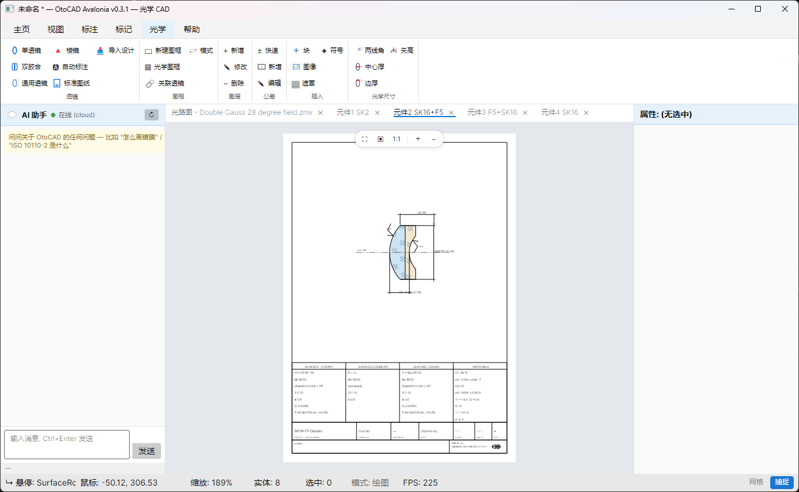

# OtoCAD — 光学 CAD

**简体中文** | [English](README.en.md)

> **🌐 官网 & 下载：[cad.optic.chat](https://cad.optic.chat)** — 国内直连,免安装解压即用 (Windows / Linux / macOS)

> 专为光学工程师设计的二维 CAD 绘图工具, 跨平台桌面应用 (Win/Mac/Linux),
> 可选搭配 **OtoCAD Cloud** 在线服务获得 AI 助手 / 协作 / 同步能力.

[](https://github.com/otocad/Otocad-Community/actions/workflows/ci.yml)
[](LICENSE)



---

## 主要特性

### 绘图与编辑
- **绘图**: 直线 · 圆 · 圆弧 · 矩形 · 多段线 · 多边形 · 椭圆 · 样条 · 点 · 射线 · 构造线 · 文字 · 多行文本 · 引线
- **编辑**: 撤销 · 重做 · 移动 · 复制 · 旋转 · 缩放 · 镜像 · 偏移 · 删除
- **选择**: 点选 · 框选 (左→右 窗选 / 右→左 框选) · Shift 加选 · Ctrl+A 全选
- **交互**: 鼠标拖动选中实体直接移动 (AutoCAD 标准 UX)
- **捕捉**: 端点 / 中点 / 圆心 (视觉指示器, 可切换)
- **视图**: 滚轮缩放 · 中键平移 · ZoomExtents / In / Out · 网格 (自适应步长) · 原点轴

### 光学专用
- **24 种 Annotation Mark**: 镀膜 (13 种 CoatingType) · 黑化 · 抛光 · 喷砂 · 金刚石车削 · 研磨 · 表面粗糙度 · 面形精度 · 中心偏差 · 对中公差 · 表面缺陷 · 表面质量 · 表面纹理 · 有效孔径 · 焦点 · 光轴 · 装配 · 检验 · 加工 · 材料缺陷
- **ISO 10110 系列**: -2 双折射 · -3 气泡 · -4 不均匀性 · -12 非球面 · -14 波前 · 激光损伤阈值
- **6 种标注**: 线性 · 对齐 · 半径 · 直径 · 三点角度 · 坐标
- **GB/T 13323-2009 光学制图合规**: 自动尺寸标注 (R1/R2/d/Ø) · 双表 (对材料/对零件要求) · 玻璃材料库 (Schott/CDGM/Ohara/Hoya 40+ 牌号) · 棱镜实体
- **加工图出图 (ISO 10110)**: 选中单透镜/胶合件一键生成标准加工图 —— 图框 · 标题栏 · 材料/零件双表 · 尺寸标注 (R/d/Ø, 对称公差 `±`、非对称上下偏差摞排) · 玻璃剖面材料符号 (短长短) · 净口径 / 机械外径 (机械≥净) · 表面粗糙度标记

### 文档与工作流
- **多文档标签页 (MDI)**: 光路总图 + 各元件加工图分页; 标签支持关闭, 关闭前未保存自动提示 (保存 / 不保存 / 取消)
- **自动备份与恢复**: 每 30 秒增量备份到本地 (`%APPDATA%/OtoCAD/autosave`, 不覆盖原文件), 启动时检测并提示崩溃恢复

### 文件格式
- 原生: `.otocad` (JSON, 完整 lcdb 序列化)
- 导入/导出: DXF (通过 [netDxf](https://github.com/haplokuon/netDxf) MIT) · PDF · 打印
- Round-trip 自检 (视图 > Round-trip 按钮)

---

## OtoCAD Community vs OtoCAD Cloud

本仓库是 **OtoCAD Community** (MIT 开源, 跨平台桌面端), 独立可用,
包含完整的绘图 / 标注 / 光学制图能力. 不依赖任何在线服务.

OtoCAD Community 预留了 ChatPanel 等**云能力的脚手架 UI**, 实际服务接入
**OtoCAD Cloud** (商业 SaaS) — 未连接 Cloud 时这些壳保持灰色降级, 不阻塞主功能.

| 能力 | OtoCAD Community | OtoCAD Cloud |
|------|------------------|--------------|
| 绘图 / 编辑 / 选择 / 视图 / 捕捉                       | ✅ 完整 | ✅ 完整 |
| 24 Annotation Mark / ISO 10110 / GB/T 13323-2009 合规  | ✅ 完整 | ✅ 完整 |
| DXF / PDF / 打印 / 自动尺寸                            | ✅ 完整 | ✅ 完整 |
| 加工图出图 (ISO 10110 标准图纸, 逐件)                  | ✅ 完整 | ✅ 完整 |
| 多文档标签页 / 自动备份与崩溃恢复                       | ✅ 完整 | ✅ 完整 |
| 设计导入 (Zemax) → 整套系统全套自动出图                | — | ✅ |
| AI 助手 (光学制图问答)                                  | 🪧 仅 UI 脚手架 | ✅ 接入大模型 |
| 跨设备同步 / 文档云存储                                | — | ✅ |
| 模板市场 (公共 + 私有)                                 | — | ✅ |
| 团队协作 (评论 / 批注 / 多人查看)                       | — | ✅ |
| 工厂版本 (加密 / 工艺集成)                              | — | ✅ Enterprise |

OtoCAD Cloud 闭源, 由 RayPragma 提供 SaaS. 商业询价见联系方式.

---

## 快速开始

### 环境要求
- **.NET 10 SDK** (10.0.102+)
- 任何操作系统 (Windows / macOS / Linux)

### 编译运行

```bash
git clone https://github.com/otocad/Otocad-Community.git
cd Otocad-Community
dotnet build src/OtoCAD.Avalonia/OtoCAD.Avalonia.csproj
dotnet run --project src/OtoCAD.Avalonia/OtoCAD.Avalonia.csproj
```

> 主项目文件名 `OtoCAD.Avalonia` 是历史遗留 (UI 实现基于 Avalonia), 未来可能简化为 `OtoCAD`.

### 打包发布 (Windows)

```powershell
# Self-contained 单文件 exe + zip (用户解压即用, 无需安装 .NET)
.\scripts\publish-avalonia.ps1

# (可选) 装了 Inno Setup 6 → 顺手编译 .exe 安装包
.\scripts\installer\build-installer.ps1
```

输出在 `src/BuildOutput/Publish/`.

---

## 项目结构

```
Otocad-Community/
├── src/
│   ├── OtoCAD.Avalonia/     # 桌面主程序 (跨平台 UI + 渲染)
│   ├── lcdb/                # CAD 数据库 + 47 实体 + 24 Annotation
│   ├── lcinterface/         # 接口契约 (IGraphicsDraw)
│   ├── LitMath/             # 数学库 (Vector2 / Matrix3)
│   ├── netDxf/              # DXF 导入导出 (vendored, MIT)
│   ├── Config/              # 配置文件
│   ├── templates/           # 模板
│   └── UnitTestProject1/    # MSTest 单元测试
├── docs/
│   ├── 用户指南/            # 入门 / 教程
│   └── images/              # README 图片
├── scripts/
│   ├── publish-avalonia.ps1 # self-contained .exe + zip
│   └── installer/           # Inno Setup .iss + 一键脚本
└── .github/workflows/       # GitHub Actions CI
```

---

## 架构

```
┌──────────────────────────────────────────────────────────┐
│  OtoCAD Community (跨平台桌面端)                         │
└────────────────────────┬─────────────────────────────────┘
                         │
┌────────────────────────▼─────────────────────────────────┐
│  Business Core (共享)                                    │
│   lcinterface (IGraphicsDraw)                            │
│   lcdb (Entity / Database / Annotation / OpticEntity)    │
│   LitMath (Vector2 / Matrix3)                            │
└────────────────────────┬─────────────────────────────────┘
                         │ HTTPS (可选)
                         ▼
┌──────────────────────────────────────────────────────────┐
│  OtoCAD Cloud (可选, 闭源 SaaS)                          │
│   AI 助手 · 跨设备同步 · 模板市场 · 团队协作             │
└──────────────────────────────────────────────────────────┘
```

**关键设计**: `IGraphicsDraw` 接口让 lcdb 业务层完全独立于渲染后端,
未来扩展其他 UI 框架或渲染引擎只需新实现接口, 业务代码零修改.

---

## 贡献

欢迎贡献! 优先考虑:
- **跨平台 bug**: Mac/Linux 上的渲染/交互问题 (CI 会跑全平台 build)
- **命令补全**: 现有 80+ 命令, 部分占位 ("Phase 2 接入" tooltip 标记) 等待实现
- **Mark 类型扩展**: lcdb.Annotation.* 新增实体后, 1 行注册即可上 Ribbon
- **GB/T 13323-2009 合规细节**: 双表布局 / 玻璃库扩展 / 棱镜变体

> ⚠️ **本仓库是上游主仓的「快照镜像」**: 每次发布由内部主仓经脱敏导出后
> **force-push 覆盖**到这里, git 历史会被重置为单个 `Snapshot` 提交。
> 因此**直接 merge 进本仓的 PR 会在下次快照时被覆盖丢失** —— 我们不在镜像上原地合并。

贡献流程 (改动最终进入上游, 随下次快照回到本仓):
1. 先开 [Issue](https://github.com/otocad/Otocad-Community/issues) / [Discussion](https://github.com/otocad/Otocad-Community/discussions) 描述问题或提案
2. Fork + 分支 `feature/your-feature`, 本地 `dotnet build src/OtoCAD.Avalonia/` 验证, 提 PR (CI 跑 Windows build + 测试)
3. maintainer review 后, 把改动**应用到上游主仓** (而非在镜像直接 merge), 随下一次脱敏快照发布进入本仓
4. 贡献者记入致谢 ([NOTICE.md](NOTICE.md)) —— 代码进了快照, 署名也一起进

代码规范: 见 [CONTRIBUTING.md](CONTRIBUTING.md) (环境 / 提交规范 / 代码风格 / CI).

---

## 隐私

**本开源版不含任何遥测 / 埋点** —— 不发心跳、不上报使用数据。

AI 助手默认连接官方云服务 `cadask.optic.chat` 提供问答；该请求仅包含你的提问内容
与一个随机设备 ID（匿名 GUID），**不含图纸、文件或任何个人信息**。

- 不想用云助手：设环境变量 `OTOCAD_BACKEND_URL` 指向自建后端，或不打开 AI 面板。
- 其余全部 CAD 功能（绘图 / 标注 / 光学 / 导入导出）**完全离线**，不依赖任何在线服务。

## 许可证

MIT License — 查看 [LICENSE](LICENSE) 与 [NOTICE.md](NOTICE.md).

---

## 链接

- 🌐 **官网**: https://cad.optic.chat
- 📺 **B 站**: https://space.bilibili.com/88091818 (教程 / 演示视频)
- 💬 **Discussions**: https://github.com/otocad/Otocad-Community/discussions
- 🐛 **Issues**: https://github.com/otocad/Otocad-Community/issues
